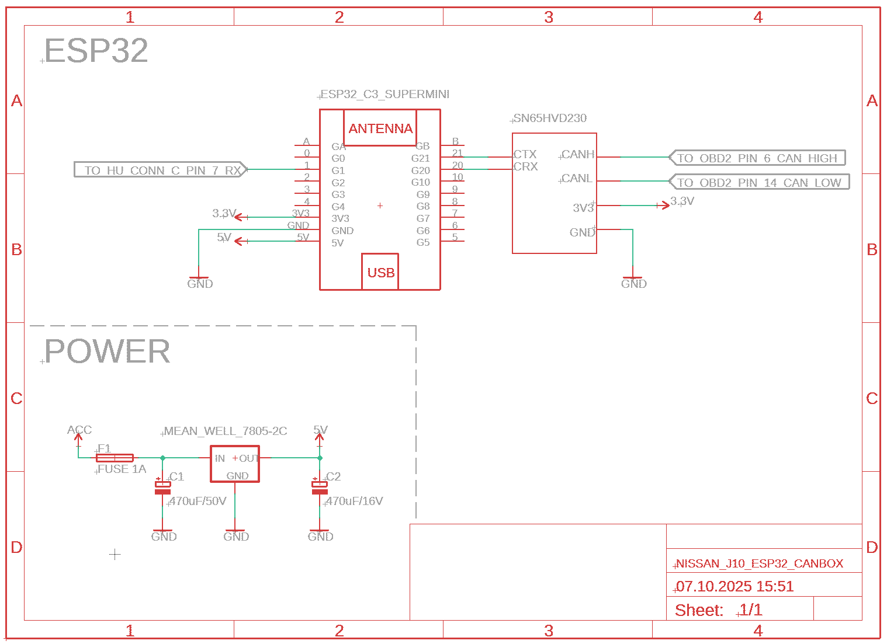

# Nissan Juke (F15) to Android Head Unit CAN Bridge (ESP32)

> **Available Languages:** [Français](README.fr.md) | **English**

<p align="center">
  
  
</p>

<p align="center">
  
  <br>
  <em>Dynamic reverse camera guidelines working with the CAN bridge</em>
</p>

This project is an intelligent gateway that integrates telemetry data from a Nissan Juke F15 (Platform B) into an Android head unit. The ESP32 intercepts **Cabin CAN bus** frames via the OBD-II port and **translates Nissan CAN frames to VW Polo protocol**.

**Why VW Polo protocol?** Most Android head units (like those running DuduOS, FYT, etc.) have much better native support for VW/Polo CAN protocol than for Nissan. By translating the frames, we get better integration: working dashboard widgets, door status, reverse camera guidelines, and more.

> **Important:** In your head unit settings, configure the CAN protocol as **"VW Polo" (2009-2018)** for this to work.

---

## Features

- **Real-time data translation** from Nissan CAN to VW protocol
- **Steering wheel angle** for reverse camera guidelines
- **Dashboard data**: RPM, speed, battery voltage, temperature, fuel level
- **Door status** with automatic updates on change
- **Safety systems**: Hardware watchdog, CAN error monitoring, timeout protection

---

## Hardware Requirements

### Bill of Materials (BOM)

| Component | Description | Link |
| --- | --- | --- |
| **ESP32-C3 SuperMini** | Microcontroller with native TWAI (CAN) | [AliExpress](https://fr.aliexpress.com/item/1005007479144456.html) |
| **SN65HVD230** | CAN Transceiver (3.3V) | [AliExpress](https://fr.aliexpress.com/item/1005009371955871.html) |
| **L7805CV** | 5V Voltage Regulator | [AliExpress](https://fr.aliexpress.com/item/1005005961287271.html) |
| **PCB Prototype Board** | 4x6cm perfboard | [AliExpress](https://fr.aliexpress.com/item/1005008880680070.html) |
| **Capacitor 25V 470µF** | Filtering capacitor | [AliExpress](https://fr.aliexpress.com/item/1005002075527957.html) |
| **PCB Terminal Block** | Screw terminals for wiring | [AliExpress](https://fr.aliexpress.com/item/1005006642865467.html) |
| **Fuse 1A** | Protection fuse | [AliExpress](https://fr.aliexpress.com/item/1005001756852562.html) |
| **OBD-II Plug** | CAN-H (pin 6), CAN-L (pin 14) | - |

### Power Supply Note

The ESP32 is powered via **USB from the Android head unit**, not from the vehicle's 12V.

**Why?** The 12V available on the head unit's CAN connector is **permanent** (always on, even with ignition off). Using it would slowly drain the car battery when parked. By using the head unit's USB port, the ESP32 only powers on when the head unit is active.

### Wiring Diagram

<p align="center">
  
  <br>
  <em>Schematic by Polihedron</em>
</p>

### Pinout

| Component | ESP32 Pin | Destination | Note |
| --- | --- | --- | --- |
| **SN65HVD230** | `3.3V` / `GND` | Power Supply | **Do not use 5V!** |
| | `GPIO 21` | CAN-TX | Output to CAN bus |
| | `GPIO 20` | CAN-RX | Input from CAN bus |
| **Head Unit** | `GPIO 5` (TX) | RX Wire (Radio harness) | UART 38400 baud |
| | `GPIO 6` (RX) | TX Wire (Radio harness) | Handshake responses |
| **Status LED** | `GPIO 8` | Internal LED | Visual status indicator |

### OBD-II Connection

The system connects to the vehicle via the **OBD-II diagnostic port**:

```
OBD-II Connector (looking at port)
┌─────────────────────────────┐
│  1   2   3   4   5   6   7  8  │
│                                 │
│  9  10  11  12  13  14  15  16 │
└─────────────────────────────┘

Pin 6  = CAN-H (High)
Pin 14 = CAN-L (Low)
Pin 16 = +12V Battery
Pin 4/5 = Ground
```

> **Note:** OBD-II ports have built-in termination resistors, so no additional resistor is needed on the SN65HVD230 module. If your module has a 120Ω resistor (R120), you can leave it or remove it - the bus will work either way.

### About the Original CAN Box

The **original Raise/RZC CAN box** that came with the Android head unit is **kept installed**. It provides the **6V power supply for the reverse camera** and is still needed for that purpose.

The original box likely has CAN signal access on its connector, so it might be possible to tap the CAN bus from there instead of OBD-II. However, this was not tested - the OBD-II connection works well and is easier to install.

---

## Software Architecture

The system is designed to be 100% autonomous and resilient to vehicle electrical interference:

1. **[CAN Capture](docs/CAN_CAPTURE.md)**: Decodes Nissan frames (500kbps) and updates global variables (Speed, RPM, Doors, etc.)
2. **[Radio Send](docs/RADIO_SEND.md)**: Formats and transmits data to the head unit at two intervals (100ms for steering, 400ms for dashboard)
3. **Hardware Watchdog**: Automatic reboot if the program freezes for more than 5 seconds
4. **CAN Watchdog**: Forces reboot if no CAN data received for 30s while battery > 11V

---

## LED Status Codes

The LED (GPIO 8) provides quick diagnostics without requiring a PC connection:

| Pattern | Status | Meaning |
| --- | --- | --- |
| **Rapid flashing** | Normal | CAN data being received and processed |
| **Slow heartbeat (1s)** | Idle | System running, but CAN bus is silent |
| **Solid ON during boot** | Boot | System initializing |
| **No activity** | Error | System frozen or power issue |

---

## Hardware Photos

### PCB Assembly

<p align="center">
  
  
</p>

*ESP32 with SN65HVD230 CAN transceiver soldered on perfboard*

---

## Building & Flashing

This project uses **PlatformIO**. To build and flash:

```bash
# Clone the repository
git clone https://github.com/yourusername/Nissan-canbus-headunit.git
cd Nissan-canbus-headunit

# Build
pio run

# Upload to ESP32
pio run --target upload

# Monitor serial output
pio device monitor
```

---

## Supported Data

| Data | CAN ID | Update Rate | Notes |
| --- | --- | --- | --- |
| Steering Angle | 0x002 | 100ms | For camera guidelines |
| Engine RPM | 0x180 | 400ms | |
| Vehicle Speed | 0x284 | 400ms | Wheel speed sensor |
| Fuel Level | 0x5C5 | 400ms | Scaled to VW 45L tank |
| Battery Voltage | 0x6F6 | 400ms | Alternator output |
| Temperature | 0x551 | 400ms | Coolant (used as exterior) |
| Door Status | 0x60D | On change | All doors + trunk |
| Distance to Empty | 0x54C | 400ms | Estimated range |

---

## References & Credits

### Nissan CAN Documentation
- [NICOclub / Nissan Service Manuals](https://www.nicoclub.com/nissan-service-manuals)
- [Comma.ai / OpenDBC](https://github.com/commaai/opendbc/tree/master)
- [jackm / Carhack Nissan](https://github.com/jackm/carhack/blob/master/nissan.md)
- [balrog-kun / Nissan Qashqai CAN info](https://github.com/balrog-kun/nissan-qashqai-can-info)

### Radio Protocols (VW/Raise/RZC)
- [smartgauges / canbox](https://github.com/smartgauges/canbox)
- [cxsichen / Raise Protocol](https://github.com/cxsichen/helllo-world/tree/master/%E5%8D%8F%E8%AE%AE/%E7%9D%BF%E5%BF%97%E8%AF%9A)
- [DUDU-AUTO Forum / Qashqai 2011 CANbus](https://forum.dudu-auto.com/d/1786-nissan-qashqai-2011-canbus/6)

---

## License

This project is open source. See [LICENSE](LICENSE) for details.
