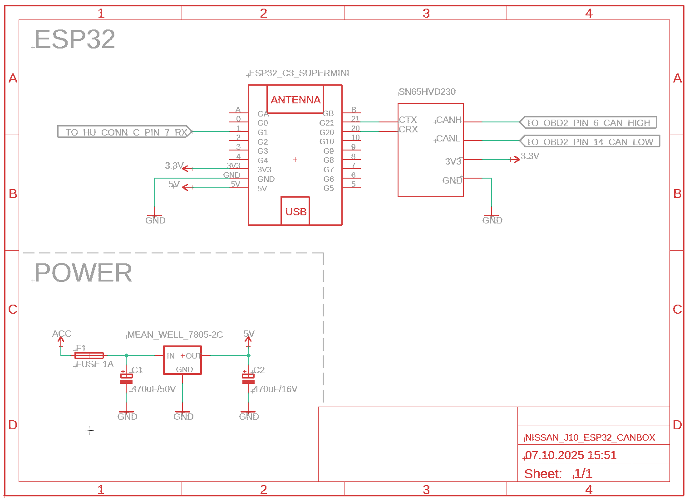

# ESP32 CANBox Bridge

> **Available Languages:** [Français](README.fr.md) | **English**

<p align="center">
  
  
</p>

<p align="center">
  
  <br>
  <em>Dynamic reverse camera guidelines working with the CAN bridge</em>
</p>

This project is a **universal CAN bridge** that connects any vehicle to an Android head unit. The ESP32 reads CAN bus frames via the OBD-II port and translates them to protocols understood by Android head units (Toyota RAV4, Raise, etc.).

The project started as a custom solution for the **Nissan Juke F15**, but has since evolved into a generic, multi-vehicle platform.

**Key features:**
- **Multi-vehicle support** — Vehicle-specific CAN mappings are defined in JSON configuration files, making it easy to add support for new cars
- **Protocol translation** — Converts manufacturer-specific CAN data to head unit protocols (Toyota RAV4, Raise/RZC)
- **No recompilation needed** — Switch vehicles or adjust calibration via USB commands

> **Important:** In your head unit settings, configure the CAN protocol as **"Toyota RAV4"** for this to work.

> **Required App:** Use **[ESP32 CANBox Manager](https://github.com/aerodomigue/esp32-canbox-manager)** (Android) to configure, calibrate, and update the firmware via USB.

---

## Features

- **Real-time data translation** from Nissan CAN to Toyota RAV4 protocol
- **Steering wheel angle** for reverse camera guidelines
- **Dashboard data**: RPM, speed, battery voltage, temperature, fuel level
- **Door status** with automatic updates on change
- **Safety systems**: Hardware watchdog, CAN error monitoring, timeout protection

### Feature Status

| Feature | Status | Notes |
| --- | --- | --- |
| Engine RPM | ✅ Working | |
| Vehicle Speed | ✅ Working | |
| Fuel Tank Level | ✅ Working | Calibrated for Juke F15 (45L tank) |
| Battery Voltage | ✅ Working | |
| Steering / Dynamic Guidelines | ✅ Working | Calibrated for Juke F15 |
| Door Status | ✅ Working | All 4 doors + trunk |
| Indicators | ✅ Working | Left/right turn signals |
| Lights | ✅ Working | Headlights, high beam, parking lights |
| Handbrake | 📋 Planned | CAN data not yet extracted |
| External Temperature | 📋 Planned | CAN data not yet extracted |
| Instant Fuel Consumption | ✅ Working | From CAN 0x580 |
| Average Fuel Consumption | ✅ Working | From CAN 0x580 |
| Distance to Empty | ✅ Working | From CAN 0x54C |

> **Note:** Documentation for the Raise/Toyota RAV4 protocol used by Android head units is scarce. Some features are still being reverse-engineered due to lack of official protocol specifications.

See the **[Roadmap](ROADMAP.md)** for upcoming features.

---

## Hardware Requirements

### Bill of Materials (BOM)

| Component | Description | Link |
| --- | --- | --- |
| **ESP32-C3 SuperMini** | Microcontroller with native TWAI (CAN) | [AliExpress](https://fr.aliexpress.com/item/1005007479144456.html) |
| **SN65HVD230** | CAN Transceiver (3.3V) | [AliExpress](https://fr.aliexpress.com/item/1005009371955871.html) |
| **L7805CV** | 5V Voltage Regulator | [AliExpress](https://fr.aliexpress.com/item/1005005961287271.html) |
| **PCB Prototype Board** | 4x6cm perfboard | [AliExpress](https://fr.aliexpress.com/item/1005008880680070.html) |
| **Capacitor 25V 470µF** | Filtering capacitor | [AliExpress](https://fr.aliexpress.com/item/1005002075527957.html) |
| **PCB Terminal Block** | Screw terminals for wiring | [AliExpress](https://fr.aliexpress.com/item/1005006642865467.html) |
| **Fuse 1A** | Protection fuse | [AliExpress](https://fr.aliexpress.com/item/1005001756852562.html) |
| **OBD-II Plug** | CAN-H (pin 6), CAN-L (pin 14) | - |

### Power Supply Note

The ESP32 is powered via **USB from the Android head unit**.

**IMPORTANT - If using 12V power instead of USB:**
- ⚠️ **NEVER use permanent 12V** - it will drain your car battery when parked
- ✅ **Use ACC (accessory) 12V only** - it turns off with the ignition
- You'll need a voltage regulator (like the L7805CV in the BOM) to convert 12V to 5V
- ⚠️ **The current 12V circuit needs improvements**: It lacks reverse polarity protection (risk of damage if wired incorrectly) and proper noise filtering for alternator-generated electrical interference. Additional components (diode, capacitors, TVS diode) would be recommended for a robust 12V power supply.

**Why USB is recommended:**
1. **Automatic power management**: USB power from the head unit is only active when the head unit is on (ACC-controlled), preventing battery drain.
2. **Voltage stability**: Automotive 12V is unstable - it varies significantly during engine start (voltage drops), alternator charging (spikes up to 14.5V), and contains electrical noise. USB provides clean, regulated 5V power.

### Wiring Diagram

<p align="center">
  
  <br>
  <em>Schematic by Polihedron</em>
</p>

### Pinout

| Component | ESP32 Pin | Destination | Note |
| --- | --- | --- | --- |
| **SN65HVD230** | `3.3V` / `GND` | Power Supply | **Do not use 5V!** |
| | `GPIO 21` | CAN-TX | Output to CAN bus |
| | `GPIO 20` | CAN-RX | Input from CAN bus |
| **Head Unit** | `GPIO 5` (TX) | RX Wire (Radio harness) | UART 38400 baud |
| | `GPIO 6` (RX) | TX Wire (Radio harness) | Handshake responses |
| **Status LED** | `GPIO 8` | Internal LED | Visual status indicator |

### OBD-II Connection

The system connects to the vehicle via the **OBD-II diagnostic port**:

```
OBD-II Connector (looking at port)
┌─────────────────────────────┐
│  1   2   3   4   5   6   7  8  │
│                                 │
│  9  10  11  12  13  14  15  16 │
└─────────────────────────────┘

Pin 6  = CAN-H (High)
Pin 14 = CAN-L (Low)
Pin 16 = +12V Battery
Pin 4/5 = Ground
```

> **Note:** OBD-II ports have built-in termination resistors, so no additional resistor is needed on the SN65HVD230 module. If your module has a 120Ω resistor (R120), you can leave it or remove it - the bus will work either way.

### About the Original CAN Box

The **original Raise/RZC CAN box** that came with the Android head unit is **kept installed**. It provides the **6V power supply for the reverse camera** and is still needed for that purpose.

The original box likely has CAN signal access on its connector, so it might be possible to tap the CAN bus from there instead of OBD-II. However, this was not tested - the OBD-II connection works well and is easier to install.

---

## USB Configuration (V2)

The device can be configured via USB serial without recompiling. Connect to the USB port and use a terminal at **115200 baud**.

### Available Commands

| Command | Description |
| --- | --- |
| `CFG LIST` | Show calibration parameters |
| `CFG SET <param> <value>` | Change a parameter |
| `CFG SAVE` | Save to flash (NVS) |
| `CAN STATUS` | Show CAN config status (MOCK/REAL mode) |
| `CAN LIST` | List vehicle config files |
| `CAN LOAD <file>` | Load a vehicle config |
| `CAN UPLOAD START/DATA/END` | Upload config via Base64 |
| `SYS INFO` | System information |
| `SYS DATA` | Live vehicle data |
| `HELP` | Full command list |

See **[USB Serial Protocol Documentation](docs/protocols/USB_SERIAL_PROTOCOL.md)** for complete details.

### Multi-Vehicle Support

Vehicle configurations are stored as JSON files on the device's filesystem. You can:
- Upload multiple vehicle configs (NissanJukeF15.json, ToyotaCorolla.json, etc.)
- Switch between vehicles with `CAN LOAD <file>`
- Use **Mock Mode** for testing without a vehicle

---

## Software Architecture

The system is designed to be 100% autonomous and resilient to vehicle electrical interference:

1. **[CAN Capture](docs/technical/CAN_CAPTURE.md)**: Decodes frames using JSON configuration and updates global variables
2. **[Radio Send](docs/technical/RADIO_SEND.md)**: Formats and transmits data to the head unit at multiple intervals (200ms for steering, 333ms for RPM, 500ms for speed, etc.)
3. **ConfigManager**: Persistent calibration storage (NVS)
4. **SerialCommand**: USB configuration interface
5. **Hardware Watchdog**: Automatic reboot if the program freezes for more than 5 seconds
6. **CAN Watchdog**: Forces reboot if no CAN data received for 30s while battery > 11V

---

## LED Status Codes

The LED (GPIO 8) provides quick diagnostics without requiring a PC connection:

| Pattern | Status | Meaning |
| --- | --- | --- |
| **Rapid flashing** | Normal | CAN data being received and processed |
| **Slow blink (500ms)** | Mock Mode | Running with simulated data |
| **Slow heartbeat (1s)** | Idle | System running, but CAN bus is silent |
| **Solid ON during boot** | Boot | System initializing |
| **No activity** | Error | System frozen or power issue |

---

## Hardware Photos

### PCB Assembly

<p align="center">
  
  
</p>

*ESP32 with SN65HVD230 CAN transceiver soldered on perfboard*

---

## Installation & Setup

Setting up your ESP32 CANBox Bridge follows a simple two-step process:

### 1. Initial Firmware Flash
The ESP32 must be flashed with the firmware before installation. Use one of these methods:

- **Option A: Web Browser (Recommended)**
  Open **[web.esphome.io](https://web.esphome.io/)** in a Chrome-based browser.
  1. Download the **`all-firmware.bin`** from the [Latest Releases](https://github.com/aerodomigue/Nissan-canbus-headunit/releases). This single file contains the bootloader, partitions, and app.
  2. Connect your ESP32 to your computer via USB.
  3. Click **Connect**, then **Install** and select the `all-firmware.bin` file.

- **Option B: Android Phone (No PC needed)**
  You can flash from your phone using an **USB OTG adapter** and the **[ESP32 Loader](https://play.google.com/store/apps/details?id=com.bluedot.esp32loader)** app. Select the `all-firmware.bin` and flash it to the ESP32.

- **Option C: PlatformIO (Developers)**
  If you are working with the source code:
  ```bash
  pio run --target upload
  ```
  *Note: A `all-firmware.bin` is automatically generated in `.pio/build/` after each build.*

### 2. Configuration & Management
Once flashed, connect the ESP32 to your Android head unit's USB port. All further configuration is done via the companion app:

**[ESP32 CANBox Manager](https://github.com/aerodomigue/esp32-canbox-manager)** (Android App)
- **Select Vehicle**: Load the specific `.json` config for your car.
- **Calibrate**: Set steering wheel offsets and tank capacity.
- **OTA Updates**: Update future firmware versions wirelessly from the app.

---

## Supported Data

| Data | CAN ID | Send Rate | Notes |
| --- | --- | --- | --- |
| Steering Angle | 0x002 | 200ms | For camera guidelines |
| Engine RPM | 0x180 | 333ms | |
| Vehicle Speed | 0x284 | 500ms | Wheel speed sensor |
| Fuel Level | 0x5C5 | — | Mapped to 45L (Juke F15 tank capacity) |
| Battery Voltage | 0x6F6 | — | Alternator output |
| Temperature | 0x551 | 5000ms | Coolant (used as exterior) |
| Door Status | 0x60D | 250ms | All doors + trunk (or on change) |
| Distance to Empty | 0x54C | 5000ms | Estimated range |
| Instant Fuel Consumption | 0x580 | 1000ms | 0.1 L/100km units |
| Average Fuel Consumption | 0x580 | 5000ms | 0.1 L/100km units |
| Odometer | 0x5C5 | 10000ms | Total km (24-bit) |

---

## Companion App

**[ESP32 CANBox Manager](https://github.com/aerodomigue/esp32-canbox-manager)** - Android app to configure and monitor the CANBox via USB.

Features:
- Live vehicle data dashboard
- CAN configuration management
- Calibration parameter tuning
- Firmware updates (OTA)
- CAN frame debugging

---

## References & Credits

### Nissan CAN Documentation
- [NICOclub / Nissan Service Manuals](https://www.nicoclub.com/nissan-service-manuals)
- [Comma.ai / OpenDBC](https://github.com/commaai/opendbc/tree/master)
- [jackm / Carhack Nissan](https://github.com/jackm/carhack/blob/master/nissan.md)
- [balrog-kun / Nissan Qashqai CAN info](https://github.com/balrog-kun/nissan-qashqai-can-info)

### Radio Protocols (Toyota/Raise/RZC)
- **[Toyota RAV4 Protocol Analysis](docs/protocols/raise-toyota-rav4/RAV4_BODY_ENGINE_2018_2020.pdf)** - Compiled and analyzed by [Mikescotland](https://forum.dudu-auto.com/u/Mikescotland) (Original Source)
- [Official Raise Protocol (Chinese)](docs/protocols/raise-toyota-rav4/) - Supplementary documentation
- [smartgauges / canbox](https://github.com/smartgauges/canbox)
- [cxsichen / Raise Protocol](https://github.com/cxsichen/helllo-world/tree/master/%E5%8D%8F%E8%AE%AE/%E7%9D%BF%E5%BF%97%E8%AF%9A)
- [DUDU-AUTO Forum / Qashqai 2011 CANbus](https://forum.dudu-auto.com/d/1786-nissan-qashqai-2011-canbus/6)

---

## License

This project is open source. See [LICENSE](LICENSE) for details.
